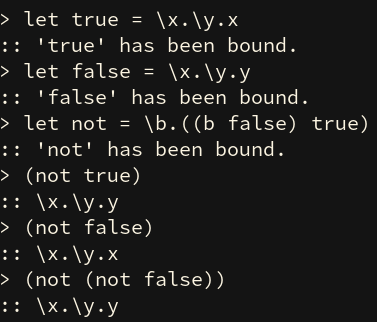

# Untyped lambda calculus interpreter

Just something I did in my spare time.



## Quick start

```bash
$ git clone git@github.com:herrhotzenplotz/lc
$ cd lc/
$ stack build
$ stack run
```

## Examples to try

+ `(\x.x \y.y)`
+ `((\x.\y.(x y) \f.f) \r.r)`
+ `let true = \x.\y.x`
+ `let false = \x.\y.y`
+ `let not = \b.((b false) true)`
+ `(not false)`
+ `release true` (removes globally bound true)

## Loading files

```bash
$ lc bool.lc fixpoint.lc
```

## Notes
Because the interpreter internally uses closures, you might sometimes
be getting seemingly incorrect results. These results should start
with a `'` sign, showing that this result still has values bound in
the closure, that have not yet been applied. This is the lazy
evaluation mechanism. To force a result, simply apply an identity
function or something else to force the lazy thunk to evaluate.

## Contributions

If you want to submit pull requests or file issues, please feel free
to do that. I'll address them as soon as I can.

## License

The lc is released under a three clause BSD license. Please see the
LICENSE file.
